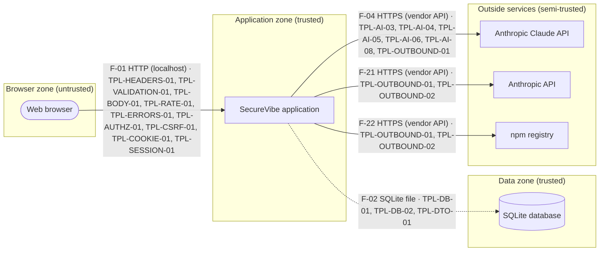

# SecureVibe — design document

Generated by SecureVibe on 2026-09-17 from the design profile (hash `527641b61562`), following the OWASP Secure by Design Framework v0.5. This document is derived by rules from the answers given in the wizard; it is not a certification.

- Used by: only you
- Runs: on this computer only
- Security contact: The person running SecureVibe on this computer (owner@example.invalid)
- Target verification level: 2 — Level 2 (standard) because it includes an AI assistant that accepts untrusted input.
- Care level: Extra care

## What we will build

SecureVibe is a local tool for one person that runs on this computer only and listens on 127.0.0.1. It has no accounts: a browser gets a session only by opening the private startup link SecureVibe prints, and every request is checked for its host, its origin and a security token. Designs, generated applications and reports stay on this computer; only what is needed to design, write and review code is sent to the Anthropic API, and only when a key is configured. Code it generates runs under Node's permission model, limited to that project's folder, with time limits and a minimal environment. A threat model lists 22 ways things could go wrong, and 1 of them needs an action from the owner.

### What this means for you

- People must sign in
- The first administrator gets a one-time password that must be changed at first sign-in
- Every person can turn on an authenticator app for their own account
- An administrator creates every account
- Sessions end after 15 minutes without activity and after 8 hours at most
- The AI assistant needs an Anthropic API key and costs money per use (each person has a daily budget)
- Messages to the assistant leave this computer and go to the AI provider
- The assistant can suggest changes, but a person must confirm each one
- SecureVibe talks to Anthropic API and npm registry; their addresses must be listed in the configuration file
- The app only works on this computer; sharing it later means changing that answer and rebuilding
- The person running SecureVibe on this computer is the security contact named in the incident plan

## 1. Security requirements (SbD step 1)

| Id | Requirement | Category | Driven by | ASVS | AISVS | SbD |
| --- | --- | --- | --- | --- | --- | --- |
| SR-01 | SecureVibe only listens on this computer. Nothing on the network can reach it. | confidentiality | deployment.target |  |  | AS-01, AC-01 |
| SR-02 | Every piece of input is checked on the server before it is used. Unexpected fields are rejected. | integrity | app.entities | V2.2.1, V2.2.2, V15.3.3, V1.2.4, V1.2.1 |  | AS-05 |
| SR-03 | The browser is protected: strict security headers, no cross-site request forgery, no inline scripts. | integrity | app.category | V3.4.3, V3.5.1, V3.3.2 |  | AS-01 |
| SR-04 | When something goes wrong, people see a short generic message. Technical details never leak. | confidentiality | app.category | V16.5.1, V16.5.3 |  | RR-01 |
| SR-05 | Security-relevant actions (sign-ins, denied access, changes by administrators) are recorded in a tamper-evident log kept for at least 12 months. | accountability | users.roles, deployment.owner | V16.2.1, V16.3.1, V16.3.2, V16.4.2 |  | MT-01, MT-07 |
| SR-06 | The app limits how many requests one person or address can make, stops slow requests, and reports whether it is healthy. | availability | users.audience, users.expectedUserCount | V2.4.1, V15.2.2 |  | RR-06, RR-07 |
| SR-07 | Secrets and keys live only in the configuration file, never in code, logs or reports. | confidentiality | deployment.target | V13.3.2, V16.2.5 |  | AC-05 |
| SR-08 | Third-party packages are locked to tested versions, inventoried, and checked for known problems. | integrity | app.category | V15.1.1, V15.1.2, V15.2.1 |  | RR-01 |
| SR-09 | A written incident plan names The person running SecureVibe on this computer as the security contact and says what to do when something goes wrong. | compliance | deployment.owner | V6.1.1 |  | MT-06 |
| SR-10 | Saving the same form twice, or two people editing at once, never corrupts a record. | integrity | app.entities | V2.3.3 |  | DM-03, RR-05 |
| SR-11 | People must sign in with a password of at least 12 characters before using SecureVibe. Guessing attempts are slowed down and locked temporarily. | confidentiality | users.requiresSignIn, users.audience | V6.2.1, V6.2.4, V6.3.1, V6.3.2, V11.4.2 |  | AC-02 |
| SR-12 | Each role only gets what it needs (Administrator). Records with an owner are visible only to that owner and administrators. | confidentiality | users.roles, app.entities | V8.2.1, V8.2.2, V8.3.1, V15.3.1 |  | AC-03 |
| SR-13 | Sessions end after 15 minutes of inactivity and after 8 hours at most. Logging out works on every page and ends the session on the server. | confidentiality | users.requiresSignIn | V7.2.1, V7.2.4, V7.3.1, V7.3.2, V7.4.1, V7.4.2 |  | AC-02 |
| SR-14 | No account exists with a default password. The first administrator gets a one-time password that must be changed. | confidentiality | users.roles | V6.3.2, V6.4.1 |  | AC-02 |
| SR-15 | Every person may turn on an authenticator app for their own account. | confidentiality | data.categories, users.audience | V6.5.1, V6.5.3 |  | AC-02 |
| SR-16 | Changing an email address or the authenticator setting requires the password again. | integrity | users.requiresSignIn | V7.5.1 |  | AC-02 |
| SR-17 | The AI assistant treats everything typed into it as untrusted, screens it for trickery, and checks every answer before showing it. | integrity | capabilities.aiAssistant.enabled |  | C2.1.1, C2.1.3, C2.1.4, C2.1.6, C7.1.1, C7.1.2 | AS-01 |
| SR-18 | The assistant only sees the signed-in person's own records, always through the signed-in person's own permissions. | confidentiality | capabilities.aiAssistant.dataItCanSee |  | C5.2.1, C5.2.4, C9.5.3, C9.5.4 | AC-03 |
| SR-19 | Every AI request is logged with its cost. Each person has a daily budget, and an administrator can switch the assistant off at once. | accountability | capabilities.aiAssistant.enabled |  | C12.1.1, C12.1.3, C9.1.2, C9.6.1, C12.4.3 | MT-01, RR-07 |
| SR-20 | The assistant can propose a change, but nothing happens until the person confirms it. | integrity | capabilities.aiAssistant.canTakeActions |  | C9.2.1, C9.3.2, C9.5.1 | AC-03 |
| SR-21 | SecureVibe only talks to the outside services named in its configuration. Each call has a time limit and a failure never takes the app down. | availability | capabilities.externalApis, capabilities.aiAssistant.enabled, capabilities.email | V13.2.4, V13.2.5, V12.3.2, V15.3.2, V16.5.2, V13.1.1 |  | RR-02, AS-01 |

## 2. Architecture (SbD step 2)

SecureVibe is one program running on this computer. People open it in a web browser. The browser is the untrusted side: everything it sends is checked before it is used, and every page or action first checks that the person is signed in and allowed to do it.

Records are kept in one database file in a data folder that only the app's user account can read.

The app talks to 3 outside services: Anthropic Claude API, Anthropic API and npm registry. It can only reach the addresses on its allow-list, waits at most 10 seconds for an answer, and keeps working (with that feature paused) if a service is down.

4 connections cross a trust boundary (F-01, F-04, F-21 and F-22). Each one is labelled on the diagram with the protections that guard it. The ids starting with TPL- are protections already built and tested in the base template.

Security contact: The person running SecureVibe on this computer (owner@example.invalid).

### Trust zones

| Zone | Trust | Description |
| --- | --- | --- |
| Browser zone (`browser`) | untrusted | Browsers and API clients. Every request from here is checked, validated and rate-limited. |
| Application zone (`app`) | trusted | The SecureVibe process on this computer. It listens on 127.0.0.1 only, so nothing else on the network can reach it. |
| Data zone (`data`) | trusted | The data folder on the same computer, protected by file permissions (0600/0700). |
| Outside services (`vendor`) | semi-trusted | Vendors reached over HTTPS. Only hosts on the outbound allow-list can be contacted. |

### Components

| Id | Name | Kind | Zone | Description |
| --- | --- | --- | --- | --- |
| browser | Web browser | browser | browser | The browser of each person who uses SecureVibe. Everything it sends is treated as untrusted. |
| app | SecureVibe application | web-app | app | One Node.js process (Express) that renders pages, serves the JSON API, checks every input, enforces sign-in and roles, and writes the logs. |
| db | SQLite database | database | data | A single database file in the data folder (file permissions 0600). |
| ai-provider | Anthropic Claude API | ai-provider | vendor | The hosted AI model behind the assistant. Reached over HTTPS with an API key kept in configuration. |
| external-api-1 | Anthropic API | external-api | vendor | generates and reviews the code of applications the user designs |
| external-api-2 | npm registry | external-api | vendor | installs the packages a generated application depends on |

### Data flows

| Id | From → To | Protocol | Data | Crosses boundary | Controls | Description |
| --- | --- | --- | --- | --- | --- | --- |
| F-01 | browser → app | HTTP (localhost) | passwords, confidential business information | yes | TPL-HEADERS-01, TPL-VALIDATION-01, TPL-BODY-01, TPL-RATE-01, TPL-ERRORS-01, TPL-AUTHZ-01, TPL-CSRF-01, TPL-COOKIE-01, TPL-SESSION-01 | People use SecureVibe: pages, forms, sign-in and the JSON API. |
| F-02 | app → db | SQLite file | passwords, confidential business information | no | TPL-DB-01, TPL-DB-02, TPL-DTO-01 | Reads and writes records with parameterised queries only. |
| F-04 | app → ai-provider | HTTPS (vendor API) | messages typed by the person, the person's own records (as context) | yes | TPL-AI-03, TPL-AI-04, TPL-AI-05, TPL-AI-06, TPL-AI-08, TPL-OUTBOUND-01 | Sends the screened message and permitted context to the model; validates the answer. |
| F-21 | app → external-api-1 | HTTPS (vendor API) |  | yes | TPL-OUTBOUND-01, TPL-OUTBOUND-02 | Calls Anthropic API: generates and reviews the code of applications the user designs |
| F-22 | app → external-api-2 | HTTPS (vendor API) |  | yes | TPL-OUTBOUND-01, TPL-OUTBOUND-02 | Calls npm registry: installs the packages a generated application depends on |

### Outside dependencies

| Name | Purpose | Trust | Data shared | Mitigations |
| --- | --- | --- | --- | --- |
| Anthropic API | Powers the AI assistant (generates and reviews application code). | vendor | messages typed by the person, the person's own records (as context) | Only the allowed host is reachable (outbound allow-list); Data is scoped to what the signed-in person may see; Requests and responses are validated and logged with token counts; Daily budget per person and an administrator kill switch |
| Anthropic API | generates and reviews the code of applications the user designs | vendor | none | Only this host is reachable (outbound allow-list); 10-second timeout, no automatic redirects, circuit breaker |
| npm registry | installs the packages a generated application depends on | vendor | none | Only this host is reachable (outbound allow-list); 10-second timeout, no automatic redirects, circuit breaker |
| npm registry | Installs the locked set of packages once (no install scripts). | platform | none | Locked versions (package-lock.json); Install scripts disabled; Inventory (SBOM) and update policy |
| Node.js runtime | Runs the app on this computer. | platform | none | Version pinned (22.13 or newer); No native add-ons |

### Assumptions

- SecureVibe runs as one process on one computer with one SQLite database file. No other program writes to that file.
- Only this computer can reach the app. Anyone who can log in to this computer can open it.
- The person running SecureVibe on this computer is the first administrator and creates or invites the other accounts.
- Whoever can read files on this computer can read the database. Disk encryption on the computer is recommended.
- The AI provider is reached over the internet. Anything sent to it leaves this computer.
- The outside services (Anthropic API and npm registry) are trusted to handle the data sent to them.
- There is no security team. Reviews are done by rules and an AI second opinion, and the owner acknowledges the results.

### Diagram

## 3. Patterns applied (SbD step 3)

| Pattern | Principle | Domain | Why | Implemented by | Checklist |
| --- | --- | --- | --- | --- | --- |
| Separate trust zones (`PAT-TRUST-ZONES`) | zero-trust-explicit-boundaries | A | SecureVibe keeps web pages, its own logic, its data and outside services in separate compartments, so a problem in one cannot spread to the others. | TPL-TRUSTZONES-01, TPL-OUTBOUND-01 | AS-01 |
| Deny by default (`PAT-DENY-BY-DEFAULT-ROUTES`) | secure-defaults | D | Because SecureVibe has sign-in, every page must say who is allowed to open it; anything not explicitly allowed is refused. | TPL-AUTHZ-01 | AC-03 |
| Least-privilege roles (`PAT-LEAST-PRIVILEGE-ROLES`) | least-privilege | D | SecureVibe has different kinds of users, so each role only sees and changes what its job requires, and people can only open their own records. | TPL-AUTHZ-01, TPL-AUTHZ-02, TPL-AUTHZ-03 | AC-03 |
| Secure browser defaults (`PAT-SECURE-DEFAULT-HEADERS`) | secure-defaults | D | SecureVibe sends browser protection headers on every page, which blocks whole families of attacks such as injected scripts and click-jacking. | TPL-HEADERS-01, TPL-HEADERS-02, TPL-HEADERS-04, TPL-HEADERS-05, TPL-COOKIE-01, TPL-VIEWS-01 |  |
| Contract-first input rules (`PAT-CONTRACT-FIRST-VALIDATION`) | contract-first-versioned-interfaces | A | SecureVibe checks every piece of input against a strict description before using it, so malformed or unexpected data is refused at the door. | TPL-VALIDATION-01, TPL-VALIDATION-02, TPL-CONTRACT-01, TPL-BODY-01 | AS-05 |
| Fail securely (`PAT-FAIL-SECURE-ERRORS`) | fail-secure-graceful-degradation | C | If something breaks inside SecureVibe, it fails closed and never shows internal details that could help an attacker. | TPL-ERRORS-01 | RR-01 |
| Security events are logged (`PAT-OBSERVABILITY-EVENTS`) | observability-by-design | E | SecureVibe records who did what and when, so you can investigate a problem later without exposing passwords or personal data in the logs. | TPL-LOG-01, TPL-LOG-02, TPL-LOG-03, TPL-LOG-04, TPL-LOG-06 | MT-01 |
| Tamper-evident audit log (`PAT-AUDIT-CHAIN`) | observability-by-design | E | SecureVibe keeps an audit trail that shows if anyone tried to alter or delete past records of what happened. | TPL-LOG-05 | MT-07 |
| Safe to repeat (`PAT-IDEMPOTENT-MUTATIONS`) | fail-secure-graceful-degradation | B | If a request to SecureVibe is sent twice by mistake (a double click or a flaky connection), nothing is created or charged twice. | TPL-IDEMPOTENCY-01 | RR-05, DM-03 |
| Timeouts and health checks (`PAT-TIMEOUTS-HEALTH`) | fail-secure-graceful-degradation | C | SecureVibe never hangs waiting forever, and a monitoring tool can check that it is up. | TPL-RESILIENCE-01, TPL-HEALTH-01 | RR-06 |
| Rate limits and quotas (`PAT-RATE-LIMITS`) | defense-in-depth | C | Nobody can guess passwords by trying thousands of times or flood SecureVibe with requests. | TPL-RATE-01, TPL-AUTH-05, TPL-MFA-03, TPL-PROXY-01 | RR-07 |
| Secrets outside the code (`PAT-SECRETS-FROM-ENV`) | secure-defaults | D | SecureVibe's secret keys are generated for you, kept out of the code and checked at start-up, so a leaked copy of the code does not leak the keys. | TPL-SECRETS-01 | AC-05 |
| Two-factor authentication for administrators (`PAT-ADMIN-MFA`) | defense-in-depth | D | Administrators of SecureVibe can do the most damage if their password leaks, so they must also enter a code from an authenticator app. | TPL-MFA-01, TPL-MFA-02, TPL-MFA-03, TPL-MFA-04 | AC-02 |
| Two-factor authentication for everyone (`PAT-USER-MFA`) | defense-in-depth | D | SecureVibe needs a higher level of protection, so every user can add a second sign-in step, not only administrators. | TPL-MFA-01, TPL-MFA-02, TPL-MFA-04, TPL-SESSION-08 |  |
| Outbound connections on an allow-list (`PAT-EGRESS-ALLOWLIST`) | zero-trust-explicit-boundaries | D | SecureVibe talks to outside services, so it may only reach the addresses on its allow-list and never follows a link somewhere unexpected. | TPL-OUTBOUND-01, TPL-OUTBOUND-02 | AS-01, RR-02 |
| AI assistant guard-rails (`PAT-AI-GUARDRAILS`) | zero-trust-explicit-boundaries | D | SecureVibe includes an AI assistant, so everything going in and coming out of it is checked, budgeted and logged, and you can switch it off at any time. | TPL-AI-01, TPL-AI-02, TPL-AI-03, TPL-AI-04, TPL-AI-05, TPL-AI-06, TPL-AI-07, TPL-AI-08 |  |
| A person approves AI actions (`PAT-AI-HUMAN-APPROVAL`) | least-privilege | D | The assistant in SecureVibe may change records, so every change is shown to the person first and only happens after they confirm it. | TPL-AI-ACTIONS-01 |  |
| Locked and listed dependencies (`PAT-SBOM-PINNED-DEPS`) | automation-repeatability | C | SecureVibe uses a fixed, tested set of third-party packages, with a list of what is inside and a rule for how fast to update when a problem is found. | TPL-DEPS-01 | RR-01 |
| Incident response plan (`PAT-IR-PLAN`) | observability-by-design | E | If something goes wrong with SecureVibe, you have a short written plan to follow instead of improvising. | TPL-IR-01 | MT-06 |

## 4. SbD review checklist (SbD step 4)

Yes: 18 · No: 4 · N-A: 14 · Score: 11 (threshold 6) · Critical "No": AC-02, MT-06

| Id | Control | Critical | Status | Severity if No | Justification | Evidence | Actions | ADRs |
| --- | --- | --- | --- | --- | --- | --- | --- | --- |
| AS-01 | Trust zones (logical network "Spaces") are enforced; cross-zone traffic flows only via governed integration layers (gateway/bus). | yes | Yes | high | The app has four clearly separated zones: the browser (not trusted), the app itself (trusted; listens only on this computer unless told otherwise), the data (trusted; database and files protected by file permissions) and outside providers (reached only through an allow-list of permitted addresses). Everything that crosses a zone boundary goes through the app's own checks. | template:TPL-TRUSTZONES-01, design:PAT-TRUST-ZONES, design:architecture |  | ADR-006 |
| AS-02 | Service addressing & discovery are unified and consistent across environments; intra-zone shortcuts are not used externally. |  | N-A | low | The app is a single program with one address. There are no other services that need to find or address each other. |  |  |  |
| AS-03 | Service boundaries are clear; no circular dependencies; services are right-sized; each service owns its data. |  | Yes | medium | One program owns its one database. Each feature (accounts, admin, uploads, the assistant, your own records) is a separate module that talks to the database through the same shared helpers, with no circular dependencies between modules. | design:architecture |  | ADR-002 |
| AS-04 | Architecture avoids long synchronous chains; event-driven or queued handoffs are used where appropriate. |  | N-A | low | There are no chains of services calling each other; every request is handled by the single app, with short timeouts on any outbound call. |  |  |  |
| AS-05 | API/event contracts are defined and versioned; consumers are notified before breaking changes take effect. |  | Yes | medium | Every route is declared in a central registry with its input rules, and a machine-readable description of the API (docs/openapi.json and docs/api.md) is generated from it. Changes to the API are visible in that file. | template:TPL-CONTRACT-01, design:PAT-CONTRACT-FIRST-VALIDATION |  | ADR-008 |
| AS-06 | Messaging has durability (persistence/replication/retention) with a defined DLQ strategy and triage. |  | N-A | low | The app does not use a message queue or event bus, so there is no messaging durability to design. |  |  |  |
| AS-07 | Startup resilience: services handle missing dependencies; autoscaling defined with minimum replicas. |  | Yes | low | The app checks all of its settings when it starts and refuses to start with a clear message if anything is missing or unsafe, instead of running half-working. Automatic scaling does not apply to an app that runs on one computer (that part of the control is not applicable). | template:TPL-SECRETS-01 |  |  |
| AS-08 | Legacy integrations are isolated behind an anti-corruption layer; migration path is defined. |  | N-A | low | The app is new and does not connect to any older (legacy) system. |  |  |  |
| DM-01 | Data are classified with named owners; controls are proportional to classification. |  | Yes | medium | The app stores only business or internal data, no information about people. docs/data-protection.md records this classification and names you as the owner. | doc:docs/data-protection.md, template:TPL-DATA-01 |  | ADR-003, ADR-007 |
| DM-02 | Encryption in transit (TLS/mTLS) and at rest with managed keys and rotation is designed in. | yes | N-A | high | The app runs on this computer only, so traffic never crosses a network, and it stores no personal or sensitive information that would need encrypting at rest. Database files are protected by file permissions. | template:TPL-DB-02 |  | ADR-003, ADR-006 |
| DM-03 | Handlers and workflows are idempotent; duplicate detection/suppression is in place where needed. |  | Yes | medium | API requests that change data honour an Idempotency-Key header (a repeated request returns the stored answer instead of acting twice), and the database has unique constraints that prevent duplicate records. | template:TPL-IDEMPOTENCY-01, design:PAT-IDEMPOTENT-MUTATIONS |  | ADR-002 |
| DM-04 | Cross-service transactions use Sagas/compensations; 2PC is avoided; prefer intra-service ACID first. |  | N-A | low | There is a single database, and multi-step changes run inside one database transaction that either fully succeeds or is rolled back. No cross-service transactions exist. | template:TPL-DB-02 |  |  |
| DM-05 | Retention/deletion policies exist per data class; minimization is applied to collection/storage. |  | Yes | medium | The app stores only the business data you defined and no information about people. docs/data-retention.md records what is kept and that nothing needs a deletion schedule. | doc:docs/data-retention.md, template:TPL-DATA-01 |  | ADR-007 |
| DM-06 | Consistency model is documented; UX handles staleness/conflicts; event-sourcing considered where appropriate. |  | N-A | low | There is one database and every read sees the latest write, so there is no staleness or conflict handling to design. Records carry an updated_at value that prevents two people silently overwriting each other's edit. |  |  |  |
| RR-01 | Retries use exponential backoff + jitter; default exception handling and safe error models exist. |  | Yes | medium | Errors are handled centrally: people see a short, generic message and the details go to the log, never to the browser. Outbound calls to other services retry a limited number of times with increasing, randomised delays. | template:TPL-ERRORS-01, template:TPL-OUTBOUND-01, design:PAT-FAIL-SECURE-ERRORS |  | ADR-008 |
| RR-02 | Circuit breakers/bulkheads protect dependencies; non-critical features have fallback/degraded modes. |  | Yes | low | Calls to other services go through one outbound client with a circuit breaker: after repeated failures the app stops calling the service for a while and shows a friendly 'temporarily unavailable' message instead of hanging. | template:TPL-OUTBOUND-01, design:PAT-EGRESS-ALLOWLIST |  | ADR-005, ADR-008 |
| RR-03 | Asynchronous semantics are defined: ordering, delivery guarantees, ack/visibility timeouts; DLQs are monitored. |  | N-A | low | The app has no background jobs or message queues, so there are no asynchronous semantics to define. |  |  |  |
| RR-04 | Shared integration layers (gateway/bus) are high-availability and contain errors to prevent cross-zone failure propagation. |  | N-A | low | There is no shared gateway or message bus between services; the app is a single program. |  |  |  |
| RR-05 | All mutating endpoints enforce an Idempotency-Key; concurrency controls (locks/optimistic concurrency) are in place. |  | Yes | medium | API requests that change data honour an Idempotency-Key header, and edits check the record's updated_at value so two people cannot silently overwrite each other's change. | template:TPL-IDEMPOTENCY-01, design:PAT-IDEMPOTENT-MUTATIONS |  |  |
| RR-06 | Timeouts on all calls; health probes; explicit failover/multi-AZ strategies for critical paths. | yes | Yes | medium | Every incoming request and every outbound call has a timeout, and the app offers /healthz and /readyz endpoints so it can be checked automatically. Failover to a second location is not applicable to an app on one computer. | template:TPL-RESILIENCE-01, template:TPL-OUTBOUND-01, design:PAT-TIMEOUTS-HEALTH |  | ADR-006 |
| RR-07 | Quotas and autoscaling are defined; rate-limits enforced at edges; minimum capacity documented. |  | Yes | medium | Rate limits are enforced by the app itself on sign-in, registration, password reset, the assistant, uploads and all other routes, and each person has quotas for the records and files they create. Automatic scaling does not apply to an app on one computer. | template:TPL-RATE-01, template:TPL-AUTH-05, design:PAT-RATE-LIMITS |  | ADR-006 |
| RR-08 | Caching/CDN/back-pressure patterns are applied where appropriate; performance guardrails are defined. |  | N-A | low | There is no caching layer or content delivery network. Basic performance guardrails are still in place: request size limits, timeouts and a maximum number of rows per list. | template:TPL-BODY-01, template:TPL-DB-02 |  |  |
| AC-01 | All communications use TLS/mTLS; service identity is verified (e.g., mesh-issued certs). | yes | N-A | high | The app listens only on this computer's loopback address, so its traffic never travels over a network and there is no connection to encrypt. Service identity checks between services do not apply to a single program. | template:TPL-TRUSTZONES-01 | If you ever want to reach the app from another computer, first run it in a TLS mode (behind an HTTPS proxy or with a certificate) as described in docs/deployment.md. (a developer, before network or internet deployment) | ADR-006 |
| AC-02 | Central IdP (OIDC/OAuth2) is used; MFA enforced on privileged/admin paths; tokens are short-lived. | yes | No | high | The app keeps its own accounts instead of using a central sign-in system (identity provider). The most important parts of this control are still in place: administrators must use two-factor authentication with an authenticator app, sessions expire after inactivity and after a fixed time, and every user may turn on two-factor authentication. | template:TPL-MFA-04, template:TPL-MFA-01, template:TPL-SESSION-03, design:PAT-ADMIN-MFA | If your organisation has a central sign-in system (for example Microsoft Entra, Google Workspace or Okta), have a developer connect the app to it with OpenID Connect before it is used across several teams. (a developer, before multi-team use) | ADR-001, ADR-002 |
| AC-03 | RBAC/ABAC governs APIs and publish/consume on messaging; least privilege is applied. |  | Yes | high | Every route declares who may use it (public, any signed-in person, or specific roles) in the central registry; anything not declared is refused. Records that belong to a person can only be opened by that person or an administrator. Each role gets only the access it needs. | template:TPL-AUTHZ-01, template:TPL-AUTHZ-02, template:TPL-AUTHZ-03, design:PAT-LEAST-PRIVILEGE-ROLES, design:PAT-DENY-BY-DEFAULT-ROUTES |  | ADR-001 |
| AC-04 | Authorization is centralized at gateway/mesh via policy-as-code; shared integration services are governed. |  | N-A | medium | There is no API gateway or service mesh; the app is a single program. As a compensating control, authorisation is centralised in the app's route registry rather than scattered across the code. | template:TPL-AUTHZ-01 |  |  |
| AC-05 | Secrets are stored in a secret manager; keys/certs rotate automatically; no secrets in code/logs. |  | No | high | Secrets (session key, encryption keys, API keys) are generated strong by SecureVibe, kept in a .env file with strict file permissions, never written into code or logs, and the app refuses to start with weak or placeholder values. However there is no dedicated secret manager and keys do not rotate automatically; the field-encryption key can be rotated with a command. | template:TPL-SECRETS-01, template:TPL-CRYPTO-01, design:PAT-SECRETS-FROM-ENV | When the app is hosted online, move its secrets from the .env file into the hosting provider's secret manager and set up regular key rotation. (the hosting provider, before internet deployment) | ADR-003 |
| AC-06 | Applicable regulatory controls (e.g., privacy/financial) are identified with evidence of design alignment. |  | N-A | medium | The app handles no personal, financial or health information, so no specific privacy or financial regulation has been identified as applying to it. |  |  | ADR-007 |
| AC-07 | Least privilege extends to CI/CD, VCS apps, chat-ops, and third-party tooling; periodic reviews are scheduled. |  | N-A | low | There is no CI/CD pipeline, source-hosting app or chat-ops tooling connected to the app; it is built and run on this computer. |  |  |  |
| MT-01 | Structured centralized logs with correlation/trace IDs; administrative access is logged. |  | Yes | medium | The app writes structured (JSON) logs with a request id on every line, so one request can be followed end to end. Sign-ins, denied access, administrator actions and unexpected errors are all recorded. Centralised log collection does not apply on a single computer. | template:TPL-LOG-01, template:TPL-LOG-03, design:PAT-OBSERVABILITY-EVENTS |  | ADR-007 |
| MT-02 | Metrics/SLOs and dashboards cover service health and event-flow anomalies; alerts are actionable. |  | No | low | The app exposes health endpoints and logs, but there are no dashboards, service-level objectives or alerts. On a single computer this is acceptable; it becomes important once the app is hosted for others. | template:TPL-RESILIENCE-01 | When the app is hosted online, add uptime monitoring on /healthz and an alert for repeated errors or failed sign-ins. (the hosting provider, before internet deployment) |  |
| MT-03 | ASVS-aligned security tests and negative tests from threat-modeling are planned in the test strategy. |  | Yes | medium | The app ships with a security test suite whose tests are named after the OWASP ASVS requirements they check, plus negative tests (things that must be refused) derived from the threat model, such as anonymous access, wrong role, bad input and ownership violations. | template:TPL-TESTS-01, design:threat-model |  |  |
| MT-04 | SbD controls are verifiable in test (isolation, mTLS, authZ denials, rate-limit behavior). |  | Yes | medium | The design controls can be checked automatically: the tests and the runtime scan verify denied access for anonymous and wrong-role users, ownership checks, CSRF protection, rate limits and security headers on the running app. | template:TPL-TESTS-01, template:TPL-AUTHZ-01, template:TPL-RATE-01 |  |  |
| MT-05 | OpenAPI/AsyncAPI and event catalogs are published; ADRs/runbooks are current. |  | Yes | low | A machine-readable API description (docs/openapi.json), the design decisions (docs/adr) and the operating documents (SECURITY.md, deployment, incident response, data retention) are generated from the design and the code, so they stay current. | template:TPL-CONTRACT-01, design:adrs, doc:docs/SECURITY.md |  |  |
| MT-06 | A documented Incident Response plan (roles, comms, evidence handling) exists and is rehearsed. | yes | No | medium | A written incident response plan exists (docs/incident-response.md) with roles, contact details and steps for evidence handling, but it has not yet been rehearsed. The control asks for both a plan and a rehearsal. | doc:docs/incident-response.md, template:TPL-IR-01, design:PAT-IR-PLAN | Read docs/incident-response.md and walk through one scenario (for example 'a staff password was leaked') with the people named in it, then record the rehearsal date on the results page. (The person running SecureVibe on this computer (owner), before the app is used for real work) | ADR-007 |
| MT-07 | Audit log retention ≥12 months with tamper-evidence and a searchable hot window is defined. | yes | Yes | medium | Security events go to an append-only audit table where each row is chained to the previous one with a hash, so tampering can be detected with the audit:verify command. The retention setting keeps at least 400 days by default (more than the required 12 months) and recent entries are searchable in the admin area. On a single computer the log lives with the app, so it is tamper-evident but not stored separately. | template:TPL-LOG-05, design:PAT-AUDIT-CHAIN |  | ADR-007 |

### Mitigation plans for critical controls answered "No"

- AC-02: If your organisation has a central sign-in system (for example Microsoft Entra, Google Workspace or Okta), have a developer connect the app to it with OpenID Connect before it is used across several teams. — responsible: The person running SecureVibe on this computer (owner), due before multi-team use
- MT-06: Read docs/incident-response.md and walk through one scenario (for example 'a staff password was leaked') with the people named in it, then record the rehearsal date on the results page. — responsible: The person running SecureVibe on this computer (owner), due before the app is used for real work

### What changes when the app is deployed

- AS-01: The same zones apply once the app is online, but the app must then sit behind a TLS (HTTPS) proxy so the browser-to-app boundary is encrypted (see AC-01).
- AS-07: If the app is later hosted online, ask the hosting provider about running more than one copy and restarting it automatically.
- DM-02: If the app is ever reached over a network it must run behind a TLS (HTTPS) proxy; see docs/deployment.md.
- RR-06: When hosting online, ask the provider to monitor /healthz and to run the app in more than one place if downtime would be costly.
- RR-07: When hosting online, keep the app's limits and add the provider's own protection against floods of traffic if available.
- AC-01: Becomes 'no' the moment the app is reached over a network without TLS; run it behind an HTTPS proxy first.
- AC-02: Stays 'no' until the app is connected to a central sign-in system; admin two-factor authentication remains in place either way.
- AC-05: Becomes 'yes' once secrets live in a secret manager with automatic rotation.
- MT-01: When hosting online, send the logs to a central log service so they survive if the server is compromised.
- MT-02: Becomes 'yes' once monitoring and alerts are in place at the hosting provider.
- MT-06: Becomes 'yes' as soon as the rehearsal is recorded.
- MT-07: When hosting online, also ship the audit log to a separate log service; until then the log could be deleted by someone who controls the server.

## 5. Second opinion (SbD step 5)

Not performed yet (or skipped in preview mode). The report states this plainly.

## 6. Risk triage (SbD step 6)

**Extra care.** Because it includes an AI assistant that accepts untrusted input, SecureVibe gets extra care. What we did: we wrote a threat model that lists 22 ways things could go wrong and the protection for each. 1 of them needs an action from you before the app is used for real. It is listed in the threat model. Some protections that big companies use (AC-02 and MT-06) do not exist for an app on one computer. Each has a plan with a date and an owner. Please read the threat model and confirm you understand it. No outside security expert reviewed it.

| Trigger | Applies | Reason |
| --- | --- | --- |
| Sensitive or regulated data | no | The app stores no information about people. |
| New external exposure | no | Only you or your team use it, on this computer. |
| Novel technology or pattern | yes | It includes an AI assistant that accepts untrusted input. |
| High business impact (Tier 1) | no | An outage would be an inconvenience, not a disaster. |

Level: high. Escalation: required. Escalation required — satisfied by: generated STRIDE threat model + owner acknowledgment (pending: the owner has not acknowledged it yet) (no independent AppSec review was performed)

- Critical control AC-02 is not met: The app keeps its own accounts instead of using a central sign-in system (identity provider). The most important parts of this control are still in place: administrators must use two-factor authentication with an authenticator app, sessions expire after inactivity and after a fixed time, and every user may turn on two-factor authentication.
- Critical control MT-06 is not met: A written incident response plan exists (docs/incident-response.md) with roles, contact details and steps for evidence handling, but it has not yet been rehearsed. The control asks for both a plan and a rehearsal.
- Checklist score 11 reaches the threshold of 6.
- Trigger "Novel technology or pattern": It includes an AI assistant that accepts untrusted input.

## 7. Threat model (SbD step 7)

22 threats identified with STRIDE (2 high, 1 medium, 19 low). 21 are covered by built-in template controls. 1 need an action: T-20. See threat-model.md for the full register.

## 8. Decisions (ADRs)

| Id | Title | Date | File |
| --- | --- | --- | --- |
| ADR-001 | Authentication model: local accounts with passwords | 2026-09-17 | adr/ADR-001-authentication-model.md |
| ADR-002 | Session store: server-side sessions in SQLite | 2026-09-17 | adr/ADR-002-session-store.md |
| ADR-003 | Data encryption: file permissions and disk encryption; no field encryption | 2026-09-17 | adr/ADR-003-data-encryption-and-keys.md |
| ADR-004 | File uploads: not included | 2026-09-17 | adr/ADR-004-file-uploads.md |
| ADR-005 | AI boundary: the assistant advises, application code decides | 2026-09-17 | adr/ADR-005-ai-boundary.md |
| ADR-006 | Deployment and exposure: this computer only (loopback) | 2026-09-17 | adr/ADR-006-deployment-and-exposure.md |
| ADR-007 | Logging, audit and data retention | 2026-09-17 | adr/ADR-007-logging-and-retention.md |
| ADR-008 | Dependency policy: locked, script-free, inventoried | 2026-09-17 | adr/ADR-008-dependency-policy.md |

## 9. What will be verified after the build

- ASVS 5.0.0 at level 2: 161 applicable requirements, 92 not applicable, 92 out of level.
- AISVS 1.0: 63 applicable requirements, 83 not applicable, 45 out of level. Evaluated because SecureVibe itself uses an AI model to design and generate code, and its generation agent writes files (counted as taking actions).
- AISVS Appendix C (the build process): 33 applicable, 19 not applicable.
- Security contract: 25 rules (security-contract.md).

## 10. Build settings

Package name: `securevibe`. Sessions: 15 min idle, 8 h absolute, 5 concurrent.

| Feature | On |
| --- | --- |
| auth | true |
| adminMfa | false |
| userMfa | true |
| uploads | false |
| ai | true |
| aiActions | true |
| aiModeration | false |
| email | false |
| scheduler | false |
| publicApi | false |
| payments | false |
| fieldEncryption | false |
| retentionJobs | false |
| lanBinding | false |
| tlsMode | off |
