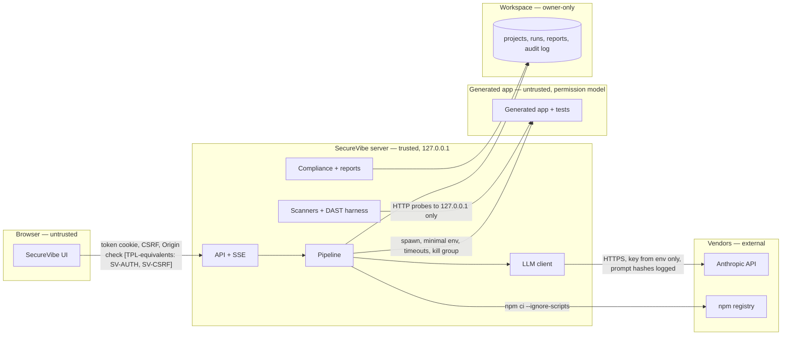

# SecureVibe — Architecture (SbD steps 2–3 for SecureVibe itself)

## Assumptions

* SecureVibe runs on one computer for one person (the owner). There is no multi-user mode.
* The owner's Anthropic API key is the most sensitive secret on the machine; the owner's project designs are
  business-confidential.
* Generated applications are untrusted code from SecureVibe's point of view: they were written by a model and may be
  edited by the owner.
* The network is untrusted, including other web pages open in the owner's browser (cross-site attacks against
  localhost services are realistic).

## Trust zones and components

| Zone | Level | Components |
|---|---|---|
| Browser (SecureVibe UI) | untrusted until the startup token is presented | React SPA served by the server |
| SecureVibe server | trusted | Express API, pipeline, scanners, compliance, reports, LLM client |
| Workspace (disk) | trusted, owner-only | `workspace/projects/<id>/…`, `llm-audit.jsonl`, `settings.json` |
| Generated app sandbox | **untrusted** | the generated app and its tests, spawned under Node's permission model |
| Vendors | external | Anthropic API (HTTPS), npm registry (HTTPS), optional advisory databases |

## Data flows

| Flow | Data | Protocol | Controls |
|---|---|---|---|
| UI → server | wizard answers (business-confidential), approvals, decisions | HTTP on loopback | startup-token session, `SameSite=Strict`, Host/Origin allow-list, CSRF token, zod validation, rate limit, body limit, CSP |
| server → Anthropic | design brief, generated file contents (never `.env`/keys), scanner output wrapped as untrusted data | HTTPS | key from env, hash-pinned prompts, instruction hierarchy, structured outputs, budgets, refusal handling, audit log with hashes |
| server → npm | package requests for the generated app | HTTPS | locked `package-lock.json`, `--ignore-scripts`, install-script detection |
| server → generated app | spawn with generated secrets and a throw-away data directory | process | Node permission model (fs read: app dir; write: app data dir), env allow-list without `ANTHROPIC_*`, timeouts, output caps, process-group kill, pid files |
| DAST → generated app | probe requests as seeded users | HTTP to 127.0.0.1:ephemeral | only ports SecureVibe started; test mode refused in production |
| server → workspace | project JSON, design artifacts, run logs, reports, audit log | file system | atomic writes, realpath confinement, redaction of secrets in logs |

## Patterns applied (SbD principles)

* **Least privilege**: the agent's tools are confined to `writablePaths`; `run_checks` accepts only named checks; the
  generated app runs with file-system permissions limited to its folder.
* **Defense in depth**: token + cookie + Origin + CSRF for the UI; deny-lists in the tool layer *and* hash verification of
  protected files afterwards; scanners + tests + probes + AI review.
* **Secure defaults**: loopback binding, strict CSP, `ignore-scripts`, preview mode without a key, spending caps.
* **Zero trust & explicit boundaries**: generated code is untrusted; model output is never executed; scanner output is
  untrusted when fed to the fixer.
* **Fail secure**: refusals and budget stops halt generation without partial writes; the pipeline continues to produce
  honest reports marked incomplete.
* **Observability by design**: correlation ids across API, pipeline stages and LLM calls; `llm-audit.jsonl`; security
  events for path denials, screening flags, kill-switch/cancel.
* **Contract-first**: `shared/src` zod schemas define every API and artifact; `CONTRACTS.md` fixes ids.
* **Automation & repeatability**: deterministic design engine; the same pipeline runs on SecureVibe itself.

## Sessions, secrets, retention

* UI sessions: startup token → `HttpOnly; SameSite=Strict` cookie for the life of the process; no persistence.
* Secrets: `ANTHROPIC_API_KEY` from the environment or `.env` (git-ignored). Generated apps receive freshly generated
  secrets written to their own `.env` (0600). Nothing secret is written to reports.
* Retention: project data stays until the owner deletes the project folder; `llm-audit.jsonl` grows append-only; full
  prompts/responses are stored per run (redacted) and can be disabled in Settings.
